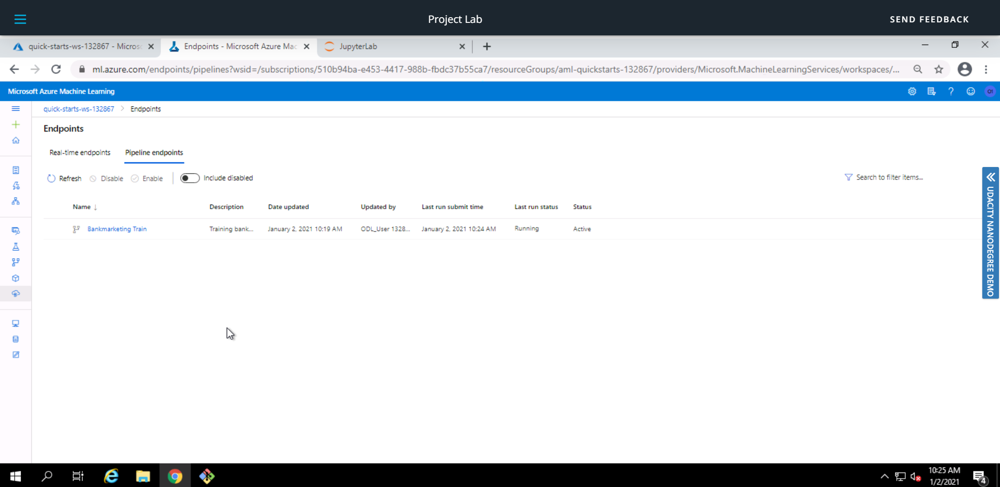

# Operationalizing Machine Learning

* This project is part of the Udacity Azure ML Nanodegree. In this project, using Azure ML, a machine learing model is created using AutoML, deployed with Azure Container Instance(ACI) and consumed. A pipeline is created and published which can be used whenever the whole process needs to repeated.

* The dataset named 'Bank marketing dataset' contains data about a Telemarketing strategy implemented by a bank. The aim is to predict if a client would subscribe to a term deposit.

## Architectural Diagram


## Key Steps
1. Creating a model
    * An AutoML run is created using the Bank Marketing Dataset and the best model produced is deployed.
    
    
    
    
    
    
 
2. Enabling Application Insights/Logging
    * Logs are used to monitor and detect problems in applications. Azure Python SDK is used to run ```logs.py``` which enables logging for the deployed model.
    
    
    
    
    
3. Swagger
    * Swagger helps in designing and consuming an API. ```swagger.sh``` will download the latest swagger container and run it on port 9000. ```serve.py```  will start a Python server.
    
    
    
4. Consuming Model Endpoint
    * ```endpoint.py``` contains two sets of inputs in the form of JSON. This input will be fed to the deployed model and the result will also be obtained in the form of JSON.
    
    
    
5. Pipeline
    * This pipeline automates the entire process and saves a lot of time. Publishing this pipeline creates a REST Endpoint which can be triggered via a HTTP request.
    
    * Pipeline Run
    
    
    * Published Pipeline endpoint
    
    
    * AutoML
    
    
    * Pipeline Overview
    
    
    * Run Details
    
    
    * Run using Pipeline Endpoint
    
    
    

## Screen Recording
* [Screencast](https://youtu.be/QDYTmJUNqr0)

## Future Work
* Deploying using AKS instead of ACI to leverage the full potential of containers offered by AKS.

* Benchmarking the endpoint using ApacheBench to measure the performance of the endpoint.

* Increasing the accuracy of the model by tinkering the parameters of AutoML and making the dataset balanced using SMOTE or other techniques.

* Creating a webpage to use the API easily.
